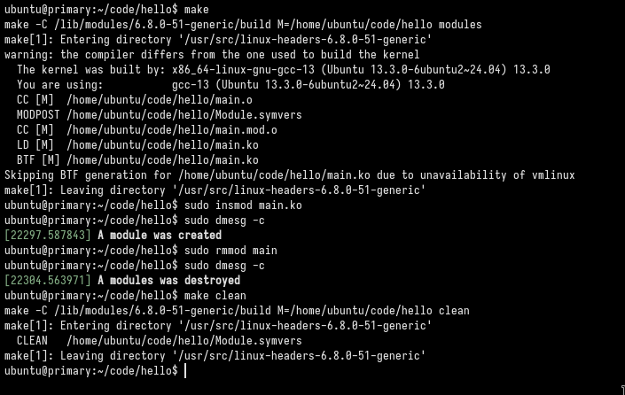

## A Totally Irrelevent Kernal Module

#### What does it do?
It copies a string to the kernal ring buffer when the module is inserted and 
also when the modules is removed from the linux kernel. 

#### How to Use it?
1. Create and start a virtualenv using multipass or something else 
*(Or dont, though I wont be resposible if you somehow managed to destroy your system with this)*
2. Install the necessary packages
    ```bash
    ### for debian users
    sudo apt install -y build-essential linux-headers-$(uname -r) kmod
    ```
3. Clone the repo or better yet type the code down from `main.c + Makefile` on to a another file to the virtualenv or anywhere you like
4. Now use the following commands on the same directory as the code:
     ```bash   
    ### To build the kernal module
    make                        

    ### To insert the kernal module
    sudo insmod main.ko         

    ### To remove the kernal module
    sudo remmod main             

    ### to print the kernal ring buffer plus the flag to clear the ring buffer
    sudo dmesg -c                  

    ### to clean up the build files created
    make clean
    ```
!</img>


